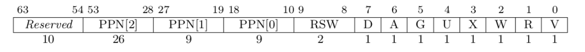

## Ch4
### 占海川 2021050009

----
#### 实现功能
1) 在`syscall/process.rs`中新增`vir_to_phy`函数, 用于将虚拟地址转换成物理地址. 
    在`sys_task_info`与`sys_get_time`中将`_ts`指针转换为物理地址即可恢复正常功能
2) 在`syscall/process.rs/sys_mmap`中新增对`未对齐/port其余位非0/无意义内存`的判断; 在`task/mod.rs`中新增`mmap`函数, 遍历目标虚存区间的虚页,
    查询对应的页是否已经映射过. 若全部未被映射, 则调用`memory_set.rs/MemorySet/insert_framed_area`, 向当前任务的MemorySet中插入一段新的MapArea
3) 在`syscall/process.rs/sys_munmap`中新增对`未对齐`的判断; 在`task/mod.rs`中新增`munmap`函数, 遍历目标虚存区间的虚页, 查询对应的页是否已经映射过. 
    若对应页已经被映射, 则调用`memory_set.rs/MemorySet/munmap`删除对应虚页与物理内存的映射.
4) 在`memory_set.rs/MemorySet`中新增`munmap`函数, 调用`unmap_one`修改对应页表项, 取消映射

----
#### 简答题
1. 请列举SV39页表页表项的组成, 描述其中的标志位有何作用？
    
    [63:54]为保留字段, [53:10]为页表起始物理地址页号, [9:8]为应用程序的保留字段, [7:0]为pte标志位
    - D表示页表项对应的虚拟页表是否被修改过
    - A表示页表项对应的虚拟页面是否被访问过
    - G表示全局地址代换
    - U控制索引到这个页表项的对应虚拟页面是否在U Mode下被允许访问
    - R/W/X分别控制索引到这个页表项的对应虚拟页面是否允许读/写/取指
    - V表示页表项是否合法

2. 1) 请问哪些异常可能是缺页导致的?

        | exception code | description            |
        |----------------|------------------------|
        | 12             | instruction page fault |
        | 13             | load page fault        |
        | 15             | store/AMO page fault   |
        上述三种异常分别发生于`取指/读写数据/存储,原子操作`时缺页
   2) 发生缺页时，描述相关重要寄存器的值
      - scause: 缺页异常发生时, interrupt段记录trap为异常, ExceptionCode段记录异常的种类
      - sstatus: 记录中断使能/当前特权等级
      - stvec: 记录处理trap的入口地址/异常处理模式
      - sscratch: 其中的值是指向hart相关的S态上下文的指针，比如内核栈的指针
      - sepc: 记录发生trap的指令虚拟地址, 用于完成trap处理后返回
      - stval: trap发生进入S态时会将异常信息写入, 用于帮助系统更快完成trap处理
   3) 这样做有哪些好处?
      部分请求可能会申请大量内存, 但真正被使用的内存很少. lazy策略可减少这部分不必要空间与时间开销. 
   4) 处理 10G 连续的内存页面，对应的 SV39 页表大致占用多少内存 (估算数量级即可)?
      10G/2^8 = 20M
   5) 请简单思考如何才能实现 Lazy 策略，缺页时又如何处理？描述合理即可，不需要考虑实现
      当应用申请内存时暂时不进行分配, 只记录分配了哪些地址. 当任务试图访问申请的内存空间时会发生缺页错误, 在处理trap时将页面映射到物理内存即可
   6) 此时页面失效如何表现在页表项(PTE)上?
      标志位`V`置`0`

3. 1) 在单页表情况下，如何更换页表?
      在S态中通过satp寄存器找到一级页表基址, 从而切换页表项与页表
   2) 单页表情况下，如何控制用户态无法访问内核页面?
      将pte标志位`U`置0
   3) 单页表有何优势?
      在切换用应用空间与内核空间时不需要更换页表, 无需实现跳板. 访问trap context不会与切换页表冲突
   4) 双页表实现下，何时需要更换页表？假设你写一个单页表操作系统，你会选择何时更换页表?
      切换用户程序/切换应用空间与内核空间; 仅在切换应用时更换页表

----
#### honor code
本人独立完成本次实验, 未抄袭他人代码, 也未将代码提供给其他人或上传公开仓库